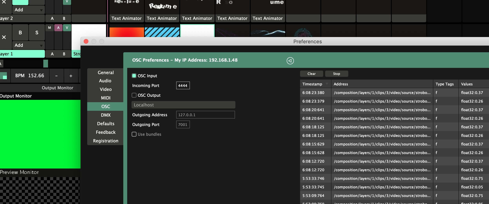

# Pose estimator to VJ
A simple script based on [TF Pose Estimation](https://github.com/ildoonet/tf-pose-estimation) by [@ildoonet](https://github.com/ildoonet) for capture video from webcamera with sending JSON and CSV data of points of body parts to VJ software like Resolume Arena and TouchDesigner via UDP and OSC.



## Features
- Actually, two points of tracking
- Tracking only first man who's been recognized before others
- Simple configure
- Jupiter Notebook run (no terminal needed)
- Comprehensive comments
- Included body parts index list

## Configure features
- Choose a data format to sent for Touch Designer (JSON or CSV)
- Swithing on/off video mode
- Debug mode (with fake data)
- Setting up of IP and PORT for sending data
- Setting of necessary points of body

## Install & Run
### Install
Just a copy files to root directory of correctly installed TF Pose Estimation (see manual at [@ildoonet](https://github.com/ildoonet) page.
### Run
```bash
$ python pose_estimation_to_udp_osc.py
```
Or execute pose_estimation_to_udp_osc.ipynb from Jupiter Notebook

### Requirements
- tensorflow >= 1.8.0
- opencv >= 3.4.1
- TfPoseEstimator
